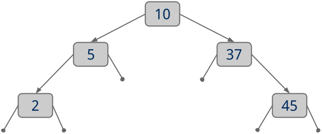

## Specifications:
Here is the specification for BST.java  
    * `put()`: Add a new key to the BST
    * `contains()`: Search the BST for a key, return `true` if the key is present, `false` if it is not.
    * `delete()`: Remove a key from the BST
    * `height()`: Return the height of the BST (a single node tree has a height of 1, an empty tree has a height of 0).
    * `isBalanced()`: Return true if the BST is height-balanced, false if it is not 
        (a height balanced binary tree is one where the left and right subtrees of all nodes differ in height by no more than 1)
    * `inOrderTraversal()`: Perform an in-order traversal of the tree and produce a String containing the keys in ascending order, separated by `':'`'s.
        Consider the following example:

        

.  
        Calling `inOrderTraversal()` on this tree should return the String `"2:5:8:10:16:37:45"`.
    * `serialize()`: Perform a pre-order traversal of the BST in order to produce a String representation of the BST.
        The reprsentation should be a comma separated list where each entry represents a single node. Each entry should take the form: *type*(*key*).
        You should track 4 node types:
        * `R`: The root of the tree
        * `I`: An interior node of the tree (e.g., not the root, not a leaf)
        * `L`: A leaf of the tree
        * `X`: A stand-in for a null reference
        For each node, you should list its left child first, then its right child. You do not need to list children of leaves.
        The `X` type is only for nodes that have one valid child. The key for an `X` node should be `NULL` (all caps).
        Consider the following:

        
.  
        Calling `serialize()` on this tree should return the String `"R(10),I(5),L(2),X(NULL),I(37),X(NULL),L(45)"`.
    * `reverse()`: Produce a deep copy of the BST that is reversed (i.e., left children hold keys greater than the current key, 
        right children hold keys less than the current key).
        We do not expect any BSTs returned by `reverse()` to have working `put()`, `contains()`, or `delete()` methods, this is fine.
        Note that a correct implementation of `serialize()` will be needed to verify the results of `reverse()`.
